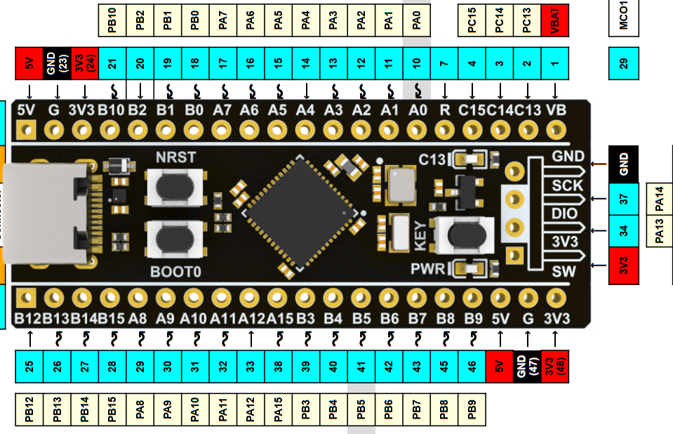

## README_blink.md
# Blinking LEDs

* Platform: STM32
* Board: STM32F411CEU6 (BlackPill)
* Copyright (C) 2024 KW Services.
* MIT License
* MicroPython 1.20

## Scope.

Turning on/off LEDs on the BlackPill board.

#### BlackPill for STM32F411CEU6.
Ensure the BlackPill is attached to the STM32F411 Base Board (the USB connect faces the edge).
And ensure you have MicroPython installed on the BlackPill.  See the github site for instructions
on flashing the firmware.  Make sure you have Thonny installed on your desktop.



## Blink an external LED at PB0 using Pin().

Follow these Steps:
1) Connect a wire between B0 and one of the LEDs.
2) Connect a wire between B10 and one of the buttons.
3) Plug your USB cable of the BlackPill into a desktop
4) Load the file bb_pyb_led_pb12.py into Thonny.
5) Click the Red STOP icon in the toolbar.
6) Click the Green Run icon in the tool bar

The application will display a few information messages and then wait.
Each time you press the user button, the program will turn on the led,
pause and then turn off the led. Press a button again to light the led.

To exit, make sure your focus is in the shell pane, and click Control C.


Quick look:
```python
from pyb import Pin
import time

led = Pin('PB0', mode=Pin.OUT)
led.on()
time.sleep(1)
led.off()
```

[Link to example code](./bb_pyb_led_pb0.py)

## Conclusion.
The base board makes it easy to incorporate common user devices like buttons and indicators into your projects.

## References.
MicroPython docs 'latest' September 07, 2023: https://docs.micropython.org/en/latest/