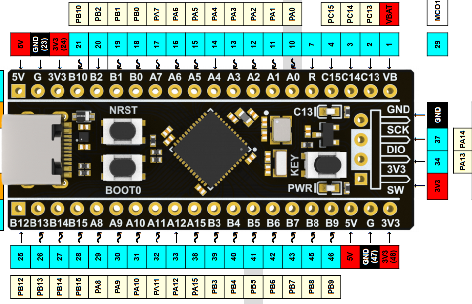

## README_button.md
# Pressing Buttons

* Platform: STM32
* Board: STM32F411CEU6 (BlackPill)
* Copyright (C) 2024 KW Services.
* MIT License
* MicroPython 1.20

## Scope of the Application.

Detect a button press with the BlackPill board.

#### BlackPill for STM32F411CEU6.

Ensure the BlackPill is attached to the STM32F411 Base Board (the USB connect faces the edge).
And ensure you have MicroPython installed on the BlackPill.  See the github site for instructions
on flashing the firmware.  Make sure you have Thonny installed on your desktop.




## Pressing an external button at PB2 using Pin from pyb module.

The example uses the builtin LED at PC13 on the BlackPill.

Follow these Steps:
1) Connect a wire between B2 and one of the buttons.
2) Plug your USB cable of the BlackPill into a desktop
3) Load the file bb_pyb_button_pb2.py into Thonny.
4) Click the Red STOP icon in the toolbar.
5) Click the Green Run icon in the tool bar

The application wil display a few information messages and then wait.
Each time you press the user button, the program will turn on the led,
pause and then turn off the led. Press a button again to light the led.

To exit, make sure your focus is in the shell pane, and click Control C.

Quick look:
```python
from pyb import Pin, LED
import time
key = Pin('PB2', Pin.IN, Pin.PULL_UP)


## Conclusion.

Although the BlackPill has a builtin button called Key, we configure our own
User button.  The base board makes it easy to incorporate common user devices like buttons into your projects.

## References.

MicroPython docs 'latest' September 07, 2023: https://docs.micropython.org/en/latest/