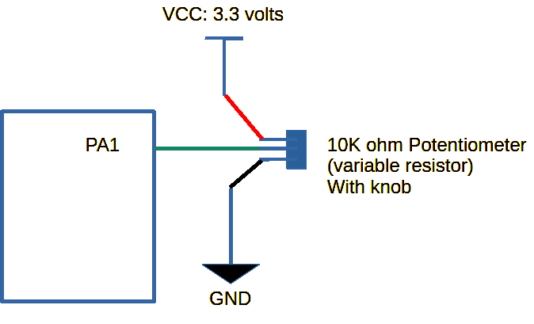

## README_ADC.md
# Reading Analog Inputs

* Platform: STM32
* Board: STM32F411CEU6 (BlackPill)
* Copyright (C) 2024 KW Services.
* MIT License
* MicroPython 1.20

## Scope of the Application.

Read analog pins with the BlackPill board.


#### BlackPill for STM32F411CEU6.

Ensure the BlackPill is attached to the STM32F411 Base Board (the USB connect faces the edge).
And ensure you have MicroPython installed on the BlackPill.  See the github site for instructions
on flashing the firmware.  Make sure you have Thonny installed on your desktop.

> Note: Thanks to Richard Balint for his pinout diagram.

[Link to pinout diagram](images/STM32F4x1_PinoutDiagram_RichardBalint.png)

Looking at the Pinout Diagram, the BlackPill has ten "ADC" pins (the bright green boxes) and three internal channels.  However, the pins also overlap with pins for Timer functions and some of the pins are dedicated:
* Flash drive - PA4,PA5,PA6,PA7
> Note: PA0 has the Key user button attached to it.

## Reading an external potentiometer using ADC.
Wire an external potentiometer ("pot") to PA1. Usually a pot is a variable 10K ohm resistor. Turning the knob with your fingers or a small screwdriver adjusts the resistance between the ground and VCC (here 3.3 volts).  Meaning you read a value between 0 and 3.3 volts.  ADC stands for Analog-to-Digital Converter. Briefly the ADC is reading the analog in steps up to 12 bits of resolution. Which means it returns a reading from zero to 4095. You then calculate the voltage by scaling your reading to 4095. (Note you can read using a different resolution; but for now lets keep the default 12 bits.)

The example uses a button to start the action of reading the potentiometer.

Follow these Steps:
1) Connect a wire between B10 nd one of the buttons.
2) Connect a wire between A1 and one of the potentiometers.
3) Plug your USB cable of the BlackPill into a desktop
4) Load the file bb_pyb_analog_pa1.py into Thonny.
4) Click the Red STOP icon in the toolbar.
5) Click the Green Run icon in the tool bar

The application wil display a few information messages and then wait.
Once you press the button, the program will read a value and then pause briefly.
Besides giving you time to see the value the ADC on the MCU needs a brief wait before its read to read another value.

To exit, make sure your focus is in the shell pane, and click Control C.



Quick Look:
```python
from pyb import ADC

#also known as channel=1
pot = ADC('PA1')

reading = pot.read()
value = (reading * 3.3) / 4095
```

[Link to (pyb) ADC example](/pyb_analog_pa1.py)

## Conclusion.
The potentiomenters are devices that utilize Analog Input. The base board makes it easy to incorporate common user devices into your projects.

## References.

MicroPython docs 'latest' September 07, 2023
 https://docs.micropython.org/en/latest/

Temperature as discussed on Micropython for kids:
* https://www.coderdojotc.org/micropython/advanced-labs/03-internal-temperature/

Discussed analog for STM32H5 mcu 
* https://github.com/micropython/micropython/issues/12048
