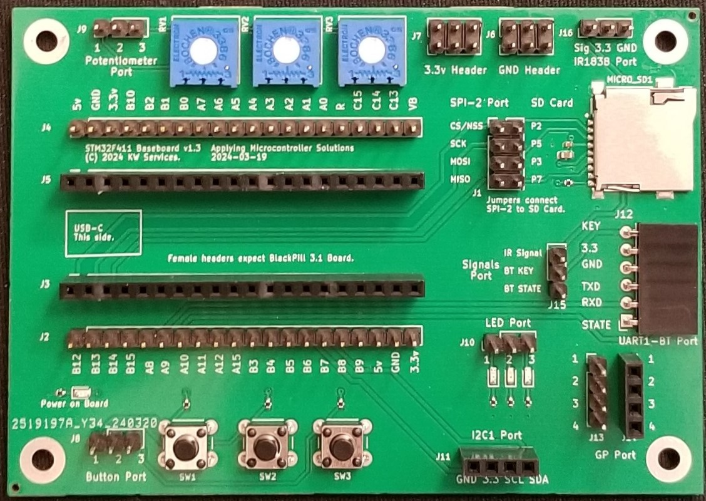

# STM32F411BaseBoard
 STM32F411 Base Board

* Platform: STM32
* Board: STM32F411CEU6 (BlackPill)
* Copyright (C) 2024 KW Services.
* MIT License
* MicroPython 1.20

## Scope.
Jump start your project with the <B>STM32F411 Base Board</B>.  The board provides a patch-wire friendly (flexible) base for the low-cost WeAct Studios' BlackPill v3.1 USB Stick board. The BlackPill is not included, however this low-cost board is available from popular retailers.  The board includes common user interface devices and ports for external devices.  

This GitHub site includes simple MicroPython examples.



The board is compatible with popular Integrated Development Environments (IDE).  The board is well suited to creating projects in MicroPython. [YouTube Video](https://www.youtube.com/watch?v=VYYiyMalOCI)

## Acquiring the STM32F411 Base Board.
To learn more, [click this link](https://www.tindie.com/products/aiy745321/stm32f411-base-board/) to visit the <B>Applying Microcontroller Solutions</B> store at Tindie.

## Acquiring the <B>BlackPill</B> (STM32F411) from WeAct Studios.
[Link to GitHub web site](https://GitHub.com/WeActStudio/WeActStudio.MiniSTM32F4x1)

1. Make sure you are getting BlackPill (STM32F411) v3.1.
2. You should get the optional 8 MB or 16 MB Flash chip pre-soldered to the bottom of the board.
3. Some retailers will sell the BlackPill board with the headers pre-soldered.
4. Also, from your favorite retailer, I suggest you acquire a "ST LINK-V2" dongle.

A copy of MicoPython firmware (version 1.20) resides on the GitHub site. [Link](https://GitHub.com/kwinter745321/STM32F411BaseBoard/tree/main/Firmware).  You can download it and skip down to the "Flashing" section below.

## Building the latest MicroPython for the BlackPill.

### Preparation.
On a Linux computer:
1. Make sure you have GCC software compiler; and "make" tools.
2. Also install the Cross Compiler for ARM (arm-none-eabi).

### Build steps.
>Note:To understand what's going on, study MicroPython.org's instructions to compile the code. [Link](https://GitHub.com/micropython/micropython).  

First though if in Ubuntu perform these steps:
```
sudo apt update
sudo apt upgrade
```

Then deploy the pre-requisites:
```
sudo apt-get install build-essential libffi-dev git pkg-config

sudo apt-get install gcc-arm-none-eabi libnewlib-arm-none-eabi
```


Follow the directions from WeAct Studios: [Link](https://GitHub.com/WeActStudio/WeAct_F411CE-MicroPython)  This includes the first step to get the basic MicroPython software from MicroPython org.  [Link](https://micropython.org/download/)

WeAct Studios has you do these steps:
```
git clone https://GitHub.com/micropython/micropython.git
cd micropython
git submodule update --init
cd mpy-cross
make -j4
cd ../ports/stm32/boards
git clone https://GitHub.com/WeActTC/WeAct_F411CE-MicroPython.git WeAct_F411CE
```

You will need to update one file to the version 3.1 board specifications.
Edit the file mpconfigboard.h:

```
/* BOARD Ver 2.0 set 1 ，other set 0 ex.V1.3,V2.1 V3.0 */
#define VERSION_V20 (0)

/* Use the built-in flash to change to 1 , use the external flash to change to 0 */
#define MICROPY_HW_ENABLE_INTERNAL_FLASH_STORAGE (0)

// Flash Size:
// 4MB Flash 32Mbit
// 8MB Flash 64Mbit
// 16MB Flash 128Mbit
#define MICROPY_HW_SPIFLASH_SIZE_BITS (64 * 1024 * 1024)
```

>Note: I changed all three above values:
1) I changed 1->0 because board is v3.1.
2) I changed 1->0 because my board includes flash chip.
3) I changed 32->64 because flash chip is 8MB.

By the way, the SPI_Flash area is correctly using A4, A5, A6, and A7.

Finally there is one more file in the WeACt distribution to edit: bdev.c.
There are two lines where a function begins with STATIC.  Replace each with the proper lowercase static.

Use change directory to go up one level to "boards" directory.
```
cd ..
```

Once more to get to the "stm32" directory.
```
cd ..
```

Okay now, continue with the build:

```
cd ..
make BOARD=WeAct_F411CE CROSS_COMPILE=/mnt/e/MCU/tools/gcc-arm-none-eabi-8-2018-q4-major/bin/arm-none-eabi- -j
```
# or

```
make BOARD=WeAct_F411CE -j
```

The make will inform you that it generated the firmware.  Look in the stm32 directory for a subfolder called "build-WeACt_F411CE".
amonsgt the many files, are the files with the name firmware.   Copy the firmware.hex to your desktop computer with the ST Microelectronics program STM32Cube Programmer.


## Flashing MicroPython firmware to a BlackPill.
You should register at the ST Microelectronics site and get their STM32Cube Programmer software (its free to registered users).

There are several ways to flash the BlackPill.

1. Via the USB-C port
2. Via a ST-LINK-V2 dongle that connects to the four SWD pins.

Now locate and copy the firmware files to your desktop.  The STM32CubeProgrammer (PRG) only needs the "hex" file.
So drag and drop that file into PRG.  Using the USB interface will work but you need to finesse the PRG connection. It's much easier to flash the board using a ST-LINK-V2 dongle and connect it to the 4-pin SWD header.
